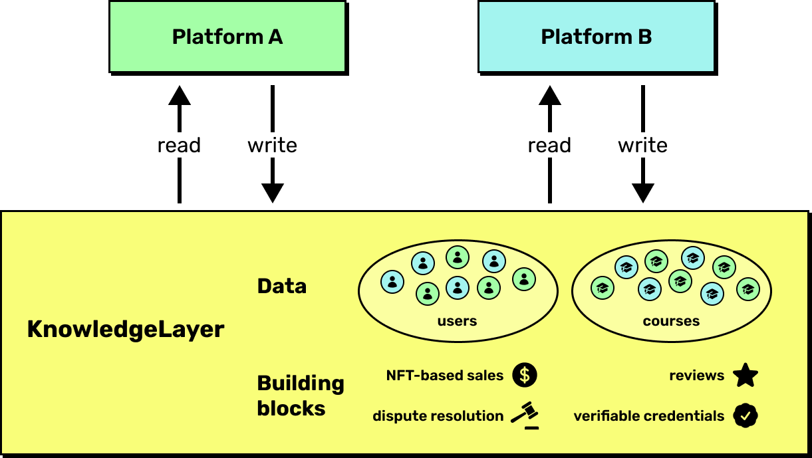

# How It Works

KnowledgeLayer is a low-level protocol for building open and interoperable education platforms. By leveraging blockchain tech, it provides the on-chain building blocks for building uncensorable and open educational platforms, such as course creation, NFT-based sales, verifiable credentials issuing, reputation and dispute resolution.

## Interoperability and Cross-Platform Transactions

In KnowledgeLayer, all the data lives on a shared layer at the protocol level, that multiple platforms can read and write to. This eliminates the siloization of platforms making them interoperable.

For example, a course posted on one platform can now be made available and purchased on other platforms as well. This results in a significant increase in discoverability and liquidity for sales, ultimately benefitting both platforms, learners and educators.

<figure><figcaption></figcaption></figure>

## Unified Identity and Reputation

On KnowledgeLayer, users mantain a unified and self-owned identity and reputation across platforms. This means that students are able to access course from all platforms with a **single profile,** which aggregates their entire educational history and credentials.

Teachers can create content that is instantly available on multiple platforms, enabling them to reach a larger audience. Additionally, their reviews and reputation are unified on a single profile owned by them, which is persistent on any platform they choose to use.

## Pooling of Users and Courses

By having all the data live at the protocol level, KnowledgeLayer creates a shared pool of learners, teachers and courses that any application can plug into.

This makes it easier for marketplaces to balance the amount of learners, teachers and content. For example, if a marketplace has a lot of learners but not enough teachers creating content, it can query more courses from the protocol and make them available to their users.

With KnowledgeLayer, any application can easily add educational features. Imagine a platform for a community that wants to provide educational content to their members, but doesn't have someone to create the content. They can now query courses from KnowledgeLayer and provide them to the community members.

